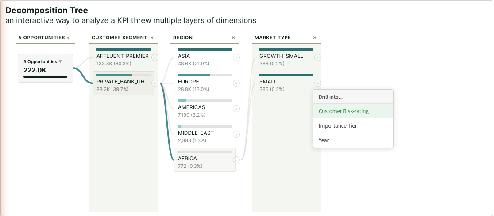

# Qix Decomposition Tree

A custom Qlik Sense supernova Decomposition Tree. Visualizes data across multiple dimensions as an interactive drill-down tree, enabling ad hoc exploration and root cause analysis.



## What It Does

The extension renders a horizontal tree where a root node (showing a measure total) branches into child nodes across dimension columns. Users click expand buttons to drill into any dimension in any order, building a custom decomposition path. Each node shows a value bar, label, and optional percentage. Clicking a node triggers a native Qlik selection.

**Key capabilities:**

- Up to 20 dimensions and 4 measures per object
- Drill-down in any dimension order (not fixed hierarchy)
- Native Qlik selections via `selectHyperCubeValues`
- Theme-aware: reads fonts, colors, selection states, and background from the active Qlik theme
- Animated connector lines between parent and child nodes
- Tooltip on hover with value, % of parent, % of total
- Dimension picker popover when multiple unused dimensions are available
- Measure switcher when multiple measures are configured
- Pagination for large dimension cardinalities
- Expansion state persisted across selections via `applyPatches`
- Native Qlik Styling Panel (background, border, shadow)

## Property Panel Options

### Layout

| Option | Values | Default |
|---|---|---|
| Font size | Small (11px), Medium (12px), Large (13px), Extra Large (14px) | Medium |
| Column width | Compact (140px), Normal (170px), Wide (220px) | Normal |
| Bar corners | Rounded, Square | Rounded |
| Bar height | Thin (4px), Medium (6px), Thick (10px), Bold (14px), Proportional to measure | Thin |
| Bar scaling | Per level (column max), Per tree (global max), Relative to root | Per level |
| Connector thickness | Thin (1px), Normal (2px), Thick (3.5px), Proportional to value | Normal |
| Nodes per page | 5–50 | 14 |
| Show percentage | Off, % of parent, % of total | Off |
| Column stripes | On, Off | On |

### Colors

| Option | Description | Default |
|---|---|---|
| Accent color | Buttons, header underlines, hover states | `#009845` |
| Column stripe color | Background color for alternating column stripes | Theme-derived |
| Color mode | Single color, Gradient by value, By expression | Single |
| Positive / primary color | Bar fill for positive values | `#2E8AB8` |
| Negative color | Bar fill for negative values | `#C94D68` |
| Gradient low / high | Start and end colors for gradient mode | `#E8F4FD` / `#1A6FA0` |
| Active connector | Color for connectors leading to expanded nodes | `#2E8AB8` |
| Inactive connector | Color for non-active connectors | `#CCCCCC` |

### Appearance

The native Qlik Styling Panel is included, providing background color/image, border radius, and shadow controls — identical to Qlik's built-in charts.

## Architecture

This extension follows the standard Qlik supernova build architecture — the same pattern used by Qlik's own first-party extensions (sn-table, sn-gantt-chart, etc.).

**Build pipeline (two steps):**

1. **Bundle npm dependencies** — esbuild compiles `src/build-libs.js` into `dist/libs.js` as a self-contained IIFE
2. **Generate UMD supernova bundle** — `src/build-dist.js` (a Node.js script) reads the libs bundle, wraps everything in a UMD module that marks `@nebula.js/stardust` as an external dependency (provided by Qlik Cloud at runtime via AMD), and writes `dist/qix-decomposition-tree.js`

The root `qix-decomposition-tree.js` is a simple AMD re-export:
```javascript
define(['./dist/qix-decomposition-tree'], function (supernova) {
  return supernova;
});
```

**Why this pattern:** `@nebula.js/stardust` must NOT be bundled — Qlik Cloud provides it at runtime. npm dependencies must be bundled because CSP blocks CDN loading. CSS is injected at runtime via `document.createElement('style')` because the RequireJS `css!` loader doesn't work in Qlik Cloud.

## Build

```bash
cd extension/qix-decomposition-tree

# Install dependencies (first time only)
npm install

# Bundle npm deps into dist/libs.js
npm run build:libs

# Generate the UMD supernova bundle
npm run build:dist

# Or both in one step
npm run build
```

**CDN caching note:** After deploying a new version, navigate the browser away from the app (e.g., to `/analytics/home`) and back to force the CDN to serve fresh files. Browser cache clearing alone does not help — Qlik Cloud caches extension files server-side.

## Theming

The extension reads from the active Qlik theme at render time:

- **Font family** — from `theme.getStyle("object", "", "fontFamily")`
- **Accent color** — first dark-enough color from the theme's color picker palette
- **Selection color** — from `theme.properties.dataColors.selected`
- **Text color** — from `theme.getStyle("object", "", "color")`
- **Background** — from the Styling Panel (`layout.components`), falling back to `theme.getStyle("object", "", "backgroundColor")`, then the parent container's computed background

All colors are applied as CSS custom properties (`--qdt-*`) so they propagate through the entire component tree without per-element DOM manipulation.

## Selection Behavior

Clicking a node triggers a native Qlik selection using `selectHyperCubeValues(path, dimNo, [elemNo], true)`. This uses `qElemNumber` (stable element identifiers) rather than row indices, ensuring the correct value is always selected regardless of sorting or filtering state. Selected nodes display a green left border and tinted background using the theme's selection color.

## Author

Manuel Reimitz
